# GitChart

Drop in a GitHub username, get back an SVG of their contribution graph.

```
/{username}
/{username}?color=blue
/{username}?color=409ba5
/{username}?from=2025-06-01&to=2026-04-20
```

Stick it in a README:

```markdown

```

## Examples

### Default (green)
`/mistakenpirate`

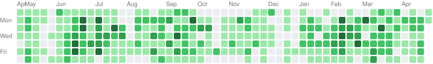

### Blue theme
`/mistakenpirate?color=blue`

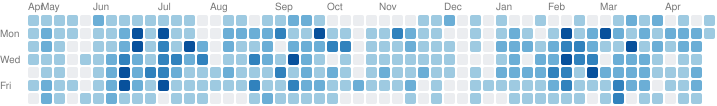

### Purple theme
`/mistakenpirate?color=purple`

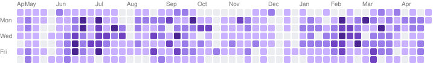

### Orange theme
`/mistakenpirate?color=orange`

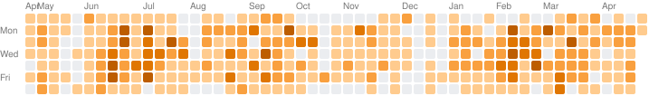

### Red theme
`/mistakenpirate?color=red`

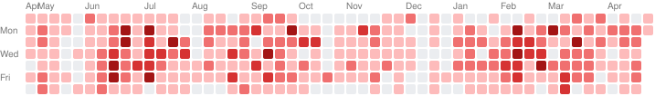

### Pink theme
`/mistakenpirate?color=pink`

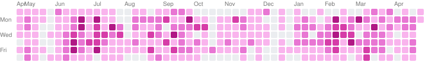

### Halloween theme
`/mistakenpirate?color=halloween`

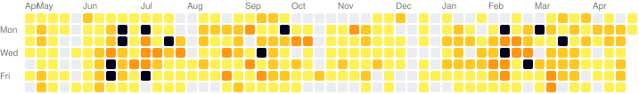

### Custom hex color
`/mistakenpirate?color=409ba5`

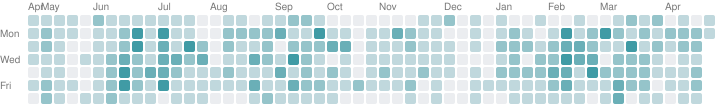

### Date range (from & to)
`/mistakenpirate?from=2025-06-01&to=2026-04-20`

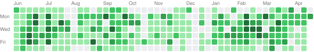

### From date only
`/mistakenpirate?from=2025-06-01`

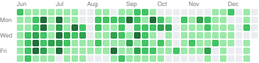

### To date only
`/mistakenpirate?to=2026-04-20`

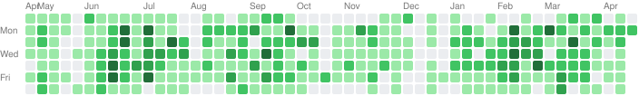

## Colors

Themes: `green` (default), `blue`, `purple`, `orange`, `red`, `pink`, `halloween`

Or pass any hex color: `?color=409ba5`

## Running it

```bash
uv run uvicorn main:app --reload
```
